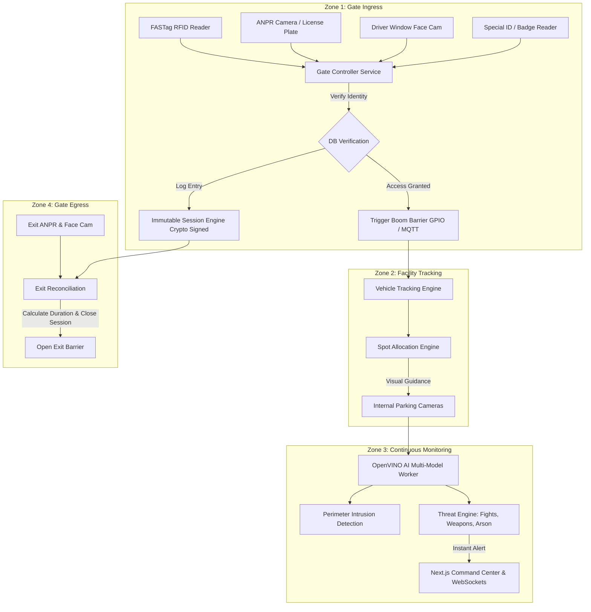

# Integrated Entrance & Parking Security System (Argus Security Enterprise)

> **Document Version**: 1.0.0  
> **Status**: Blueprint & Phased Roadmap  
> **Target System**: Argus Multi-Camera AI Security Platform  
> **Author**: Antigravity Pair-Programming Team  

---

## 1. Executive Summary

This specification outlines the architecture, database schemas, hardware integrations, AI models, and implementation roadmap for transforming **Argus** into an **Autonomous Smart Entrance & Security Operations Platform**.

The platform combines **multi-factor gate authentication** (FASTag RFID, ANPR, Driver Facial Recognition, Special ID) to control physical boom barriers, **immutable parking session tracking** with tamper-proof timers, **vehicle-to-spot camera tracking**, **perimeter intrusion detection (PIDS)**, and **real-time safety threat recognition** (fights, arson/fire, weapons).

---

## 2. System Architecture & Workflows



---

## 3. Core Subsystems

### Subsystem A: Multi-Factor Entrance Access & Boom Barrier Control
- **FASTag / RFID Reader Ingestion**: Serial/Network listener receiving RFID EPC tags.
- **ANPR (Automatic Number Plate Recognition)**: Optical Character Recognition on vehicle registration plates via OpenVINO / OCR.
- **Driver Facial Recognition Engine**:
  - Detects driver face at gate camera.
  - Matches face embedding against registered personnel DB (returns `Person Name` & `User ID`).
  - **Fallback**: If unregistered visitor, extracts facial biometric vector & snapshot, saving as anonymous metadata in DB.
- **Boom Barrier Controller**:
  - Sends pulse via relay (RS-485 / Serial / Modbus / GPIO / MQTT) upon access validation.

---

### Subsystem B: Immutable Parking Session & Vehicle Tracking
- **Tamper-Proof Session Timer**:
  - Cryptographically hashed entry timestamp (`SHA-256(SessionID + EntryTime + SecretKey)`).
  - Stored in an append-only audit ledger to prevent manual timer manipulation or fee tampering.
- **Vehicle Spot Allocation & Tracking**:
  - Recommends available parking space (Allocated vs Unallocated pool).
  - Multi-camera tracking follows vehicle bounding box across camera nodes from gate to parking bay.
- **Exit Verification & Session Closure**:
  - Exit gate ANPR + Face match verifies identity against active session.
  - Final duration, verified driver name / metadata, and billing log locked into DB.

---

### Subsystem C: Perimeter Intrusion Detection System (PIDS)
- **Tripwire & Polygon Boundaries**:
  - Configurable ROI lines and polygons for facility fences and restricted zones.
- **Intrusion Rules**:
  - Directional line crossing (e.g. outside-to-inside fence jump).
  - Off-hours loitering and restricted perimeter dwell time.

---

### Subsystem D: AI Threat & Anomaly Detection (Safety Engine)
Continuous multi-camera stream processing for critical threat classes:
1. **Violence / Physical Fights**: Action recognition model detecting violent human interactions.
2. **Arson & Fire/Smoke Detection**: Thermal/RGB vision models detecting early stage flame or smoke plumes.
3. **Weapons Detection**: Bounding-box detection for handguns, rifles, knives.
4. **Vandalism / Suspicious Behavior**: Unattended items, property destruction, loitering near vehicle trunks.

---

## 4. Proposed Database Schema Additions

```sql
-- 1. Immutable Entrance & Exit Sessions
CREATE TABLE parking_sessions (
    id VARCHAR(36) PRIMARY KEY,
    vehicle_plate VARCHAR(32) NOT NULL,
    rfid_tag VARCHAR(64),
    special_id VARCHAR(64),
    allocated_spot_id VARCHAR(36),
    
    -- Driver Profile
    driver_name VARCHAR(128),
    driver_user_id VARCHAR(36),
    driver_face_embedding JSON, -- Biometric vector metadata if unregistered
    driver_snapshot_url TEXT,

    -- Immutable Session Timers
    entry_timestamp TIMESTAMP WITH TIME ZONE NOT NULL,
    entry_signature VARCHAR(64) NOT NULL, -- Cryptographic tamper-proof hash
    exit_timestamp TIMESTAMP WITH TIME ZONE,
    exit_signature VARCHAR(64),
    
    session_status VARCHAR(32) DEFAULT 'ACTIVE', -- ACTIVE, CLOSED, FLAG_VIOLATION
    created_at TIMESTAMP WITH TIME ZONE DEFAULT CURRENT_TIMESTAMP
);

-- 2. Threat & Security Incident Audit Log
CREATE TABLE security_threat_alerts (
    id VARCHAR(36) PRIMARY KEY,
    camera_id VARCHAR(36) NOT NULL,
    threat_type VARCHAR(64) NOT NULL, -- FIGHT, ARSON, WEAPON, INTRUSION
    confidence FLOAT NOT NULL,
    bounding_boxes JSON,
    snapshot_path TEXT,
    video_clip_path TEXT,
    status VARCHAR(32) DEFAULT 'NEW', -- NEW, ACKNOWLEDGED, RESOLVED, FALSE_POSITIVE
    resolved_by VARCHAR(36),
    timestamp TIMESTAMP WITH TIME ZONE DEFAULT CURRENT_TIMESTAMP
);
```

---

## 5. Phased Implementation Roadmap (Step-by-Step)

We will execute this project module-by-module. Each phase can be reviewed and tested independently:

---

### 🔹 Phase 1: Gate Ingress Control & Multi-Factor Auth Engine
- [ ] Implement FASTag / RFID / Special ID input router (`app/routers/gate.py`).
- [ ] Integrate Driver Facial Recognition model service (`app/services/face_recognition.py`).
- [ ] Connect ANPR + Face + RFID logic to trigger Boom Barrier relay simulator/controller.
- [ ] Build Frontend Gate Access Control Panel (`frontend/src/app/(dashboard)/gate/`).

---

### 🔹 Phase 2: Immutable Session Logging & Vehicle Tracking
- [ ] Build Cryptographic Immutable Timer Ledger (`app/services/session_timer.py`).
- [ ] Implement vehicle entry-to-spot trajectory tracking logic across camera feeds.
- [ ] Implement exit gate reconciliation workflow (driver face match / metadata archiving).
- [ ] Update Parking Dashboard UI with live timer feeds and non-editable timestamp indicators.

---

### 🔹 Phase 3: Perimeter Intrusion Detection System (PIDS)
- [ ] Extend ROI zone router (`app/routers/zones.py`) with tripwires and directional vectors.
- [ ] Add line-crossing algorithm to trajectory engine (`app/services/trajectory.py`).
- [ ] Implement real-time PIDS WebSocket alert events.
- [ ] Build frontend line/polygon drawing tool update for intrusion tripwires.

---

### 🔹 Phase 4: Facility AI Threat Detection (Fights, Fire, Weapons)
- [ ] Integrate threat recognition pipeline (`app/services/threat_classifier.py`).
- [ ] Support detection for Fights, Arson/Fire/Smoke, and Weapons.
- [ ] Build Security Incident Alert Center (`frontend/src/app/(dashboard)/threats/`) with sound/visual alarms.

---

### 🔹 Phase 5: End-to-End Integration & Hardware Benchmarking
- [ ] Integrate full pipeline: Gate Ingress -> Parking Tracking -> PIDS & Threat Monitoring -> Egress.
- [ ] Perform hardware stress testing (FPS, OpenVINO inference latency, database write throughput).
- [ ] Deliver user documentation and deployment guide.

---

## 6. Next Actions

Review this blueprint document. We can begin **Phase 1** immediately by crafting the **Gate Control Engine & Multi-Factor Verification System**.
