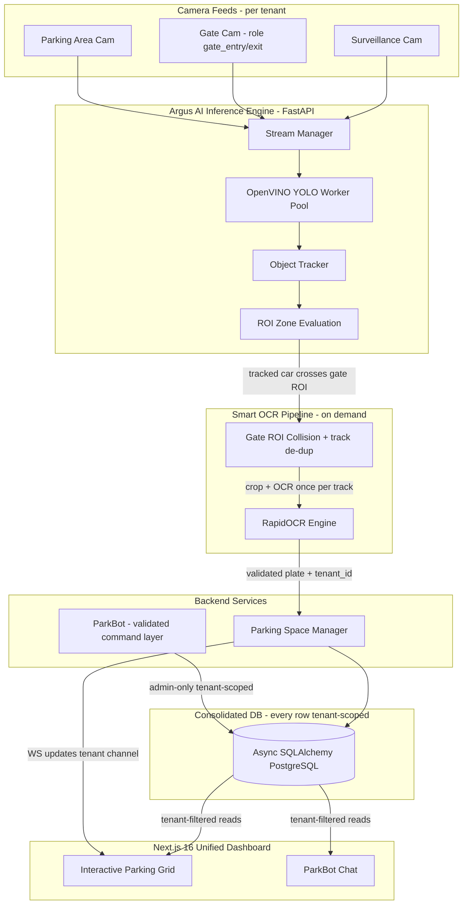

# 🅿️ AI Surveillance & Smart Parking Integration Blueprint — v2 (Corrected)

This is the **corrected** integration plan for merging the **Smart Parking System** (Flask + Haar-cascade/contour + RapidOCR + SSE) into the **Argus AI Surveillance System** (FastAPI + OpenVINO YOLO + async SQLAlchemy + Next.js 16).

v1 was architecturally sound but written against a **pre-multi-tenancy** view of Argus. Argus now enforces tenant isolation across the write path, WebSocket layer, and routers. v2 folds those invariants in so the parking feature does not re-open the cross-tenant leaks that were just closed.

**What changed from v1** (all corrections in one place):
1. Every parking model now carries `tenant_id` + tenant-scoped composite indexes.
2. `VehicleProfile` uses a **surrogate UUID PK**; plate uniqueness is `(tenant_id, plate_text)`, not a global PK. All FKs point at the surrogate id.
3. Every router is gated on `get_current_active_user` and filters by `current_user.tenant_id`; all mutations require `require_admin`.
4. Added **Alembic migration** as Phase 0 (prod is live PostgreSQL — `create_all` cannot alter it safely).
5. ParkBot command-execution is now a **validated, admin-only, structured-action** path — the LLM proposes, code validates and executes. No free-form DB mutation from chat text.
6. Added a `role` field on `Camera` so a feed can be designated a gate camera (Phase 4 depended on this but v1 added no column).
7. Corrected "Next.js 14" → **Next.js 16** (`frontend/package.json` is on `next ^16.1.6`).
8. Added a **test phase** (80%+ coverage) and a note to **de-nest** `parking-system/smart-parking-system/.git`.

---

## 🎯 High-Level Integration Strategy



**Plain-text fallback** (renders in any markdown preview without a Mermaid engine):

```text
 CAMERA FEEDS (per tenant)
 - Surveillance Cam   - Gate Cam (role=gate_entry/exit)   - Parking Area Cam
                              |
                              v
 +--------------------------------------------------+
 |  ARGUS INFERENCE ENGINE (FastAPI)                |
 |  Stream Mgr --> OpenVINO YOLO --> Tracker        |
 |                              --> ROI Zone Eval   |
 +--------------------------------------------------+
                              |  tracked car crosses gate ROI
                              v
 +--------------------------------------------------+
 |  SMART OCR (on demand)                           |
 |  Gate ROI collision + track de-dup --> RapidOCR  |
 +--------------------------------------------------+
                              |  validated plate + tenant_id
                              v
 +--------------------------------------------------+
 |  PARKING SPACE MANAGER                           |
 +--------------------------------------------------+
            |                              |
            | writes                       | WS updates (tenant channel)
            v                              |
 +----------------------------+            |
 |  DB  (every row            |            |
 |       tenant-scoped)       |<--- ParkBot (admin-only, tenant-scoped queries)
 |  async SQLAlchemy /        |            |
 |  PostgreSQL                |            |
 +----------------------------+            |
            |  tenant-filtered reads       |
            v                              v
 +--------------------------------------------------+
 |  NEXT.JS 16 DASHBOARD                            |
 |  Parking Grid      |      ParkBot Chat           |
 +--------------------------------------------------+
```

### The core innovation (unchanged — this is the win)
Replace the parking system's continuous Haar-cascade/contour scan with Argus's tracker. Fire RapidOCR **only** when a tracked `car`/`motorcycle` crosses a gate ROI, **once per track id** (de-dupe stationary vehicles). Lower CPU, higher-quality crops, no duplicate entries.

### Non-negotiable invariants (new in v2)
- **Tenant isolation**: every parking row is written with the ingesting camera's `tenant_id`; every read filters on `current_user.tenant_id`. No exceptions.
- **Auth**: no parking endpoint is anonymous. Reads → `get_current_active_user`. Writes/commands → `require_admin`.
- **Migrations, not create_all**: schema changes ship as Alembic revisions.

---

## 🗄️ Database Consolidation Plan (corrected models)

Add to `backend/yolo_classifier/app/models.py`, matching the existing house style (surrogate `String(36)` UUID PKs via `generate_uuid`, `utc_now` defaults, `tenant_id` + composite indexes).

```python
class VehicleProfile(Base):
    __tablename__ = "vehicle_profiles"
    __table_args__ = (
        # plate is unique WITHIN a tenant, never globally
        Index("uq_vehicle_profiles_tenant_plate", "tenant_id", "plate_text", unique=True),
    )

    id = Column(String(36), primary_key=True, default=generate_uuid)
    tenant_id = Column(String(36), default="1", index=True, nullable=False)
    plate_text = Column(String(20), nullable=False)
    profile_type = Column(String(20), default="normal")   # normal, vip, blacklist
    owner_name = Column(String(255), default="Visitor")
    notes = Column(Text, nullable=True)
    created_at = Column(DateTime, default=utc_now)
    updated_at = Column(DateTime, default=utc_now, onupdate=utc_now)

    parking_spot = relationship("ParkingSpace", back_populates="vehicle", uselist=False)
    detections = relationship("DetectedPlate", back_populates="profile")


class ParkingSpace(Base):
    __tablename__ = "parking_spaces"
    __table_args__ = (
        Index("uq_parking_spaces_tenant_space", "tenant_id", "space_id", unique=True),
        Index("ix_parking_spaces_tenant_occupied", "tenant_id", "is_occupied"),
    )

    id = Column(String(36), primary_key=True, default=generate_uuid)
    tenant_id = Column(String(36), default="1", index=True, nullable=False)
    space_id = Column(String(50), nullable=False)          # e.g. "A-01", "F2-08" (unique per tenant)
    zone = Column(String(10), default="A")                 # A, B, C
    floor = Column(String(10), default="G")                # G, 1, 2
    is_occupied = Column(Boolean, default=False)
    # FK on surrogate id, NOT plate_text — avoids cross-tenant natural-key collisions
    vehicle_id = Column(String(36), ForeignKey("vehicle_profiles.id"), nullable=True)
    entry_time = Column(DateTime, nullable=True)

    vehicle = relationship("VehicleProfile", back_populates="parking_spot")


class DetectedPlate(Base):
    __tablename__ = "detected_plates"
    __table_args__ = (
        Index("ix_detected_plates_tenant_time", "tenant_id", "timestamp"),
        Index("ix_detected_plates_tenant_parked", "tenant_id", "is_parked"),
    )

    id = Column(String(36), primary_key=True, default=generate_uuid)
    tenant_id = Column(String(36), default="1", index=True, nullable=False)
    plate_text = Column(String(20), nullable=False)        # denormalized for fast display/filter
    vehicle_id = Column(String(36), ForeignKey("vehicle_profiles.id"), nullable=True)
    camera_id = Column(String(36), ForeignKey("cameras.id"), nullable=True)  # provenance
    track_id = Column(String(64), nullable=True)           # tracker id → de-dup source
    state = Column(String(50), nullable=True)              # e.g. "Maharashtra"
    timestamp = Column(DateTime, default=utc_now, nullable=False)
    is_parked = Column(Boolean, default=False)
    exit_time = Column(DateTime, nullable=True)
    duration_minutes = Column(Integer, nullable=True)
    confidence = Column(Float, default=0.0)
    amount_paid = Column(Float, default=0.0)

    profile = relationship("VehicleProfile", back_populates="detections")


class ParkingSession(Base):
    __tablename__ = "parking_sessions"
    __table_args__ = (Index("ix_parking_sessions_tenant_start", "tenant_id", "start_time"),)

    id = Column(String(36), primary_key=True, default=generate_uuid)
    tenant_id = Column(String(36), default="1", index=True, nullable=False)
    start_time = Column(DateTime, default=utc_now, nullable=False)
    end_time = Column(DateTime, nullable=True)
    plates_detected = Column(Integer, default=0)
    spaces_used = Column(Integer, default=0)


class ParkingActivityLog(Base):
    __tablename__ = "parking_activity_log"
    __table_args__ = (Index("ix_parking_activity_tenant_time", "tenant_id", "timestamp"),)

    id = Column(String(36), primary_key=True, default=generate_uuid)
    tenant_id = Column(String(36), default="1", index=True, nullable=False)
    timestamp = Column(DateTime, default=utc_now, nullable=False)
    event_type = Column(String(50), nullable=False)        # entry, exit, profile_change, command
    description = Column(Text, nullable=False)
    plate_text = Column(String(20), nullable=True)
    space_id = Column(String(50), nullable=True)
    actor_user_id = Column(String(36), nullable=True)      # who triggered a manual/command action
```

### Camera model change (Phase 4 needs this)
Add to the existing `Camera` model so a feed can be flagged as a gate:

```python
    # on class Camera:
    role = Column(String(20), default="surveillance")   # surveillance | gate_entry | gate_exit
    gate_roi = Column(JSON, nullable=True)               # polygon defining the OCR trigger zone
```

---

## 🔀 API Endpoints (corrected — auth + tenant on every route)

Namespace `/api/v1/parking`. **All routes** take `current_user: User = Depends(get_current_active_user)` and filter `WHERE tenant_id == current_user.tenant_id`. Mutations swap the dependency to `require_admin`.

| v1 Flask Route | v2 FastAPI Route | Method | Auth | Tenant filter |
|---|---|---|---|---|
| `/api/stats` | `/api/v1/parking/stats` | GET | active_user | ✅ |
| `/api/spaces` | `/api/v1/parking/spaces` | GET | active_user | ✅ |
| `/api/spaces/<id>/release` | `/api/v1/parking/spaces/{id}/release` | POST | **require_admin** | ✅ (404 if space not in tenant) |
| `/api/plates` | `/api/v1/parking/plates` | GET | active_user | ✅ |
| `/api/latest_plate` | `/api/v1/parking/plates/latest` | GET | active_user | ✅ |
| `/api/activity` | `/api/v1/parking/activity` | GET | active_user | ✅ |
| `/api/events` | WS `/api/v1/parking/ws` | WS | token in query → validated, tenant channel | ✅ |
| `/chat` | `/api/v1/parking/chat` | POST/WS | active_user (read) / **require_admin** (commands) | ✅ |

Reference pattern (mirrors `routers/detections.py`):

```python
@router.get("/spaces", response_model=list[ParkingSpaceResponse])
async def list_spaces(
    db: AsyncSession = Depends(get_db),
    current_user: User = Depends(get_current_active_user),
):
    result = await db.execute(
        select(ParkingSpace).where(ParkingSpace.tenant_id == current_user.tenant_id)
    )
    return result.scalars().all()


@router.post("/spaces/{space_id}/release")
async def release_space(
    space_id: str,
    db: AsyncSession = Depends(get_db),
    current_user: User = Depends(require_admin),      # mutation → admin only
):
    space = (await db.execute(
        select(ParkingSpace).where(
            ParkingSpace.id == space_id,
            ParkingSpace.tenant_id == current_user.tenant_id,   # tenant guard on the lookup
        )
    )).scalar_one_or_none()
    if space is None:
        raise HTTPException(status_code=404, detail="Space not found")
    # ... compute tariff, log exit, publish tenant WS event ...
```

The WS endpoint reuses the token-in-query pattern already hardened in the WebSocket auth work and broadcasts only on the caller's tenant channel.

---

## 🤖 ParkBot — validated command layer (security-corrected)

v1 scanned raw chat text for `PARK CAR MH12AB1234` / `RELEASE F1-04` and mutated the DB. That is prompt-injectable and unauthenticated-by-persona. v2 makes it a **propose → validate → execute** pipeline:

1. **Read persona** (any active user): the LLM answers questions using **tenant-scoped async queries only** (available slots, today's revenue). It has no write path.
2. **Command persona** (admin only, `require_admin`): the LLM returns a **structured action**, not SQL and not a DB call:
   ```json
   { "action": "release_space", "space_id": "A-01" }
   ```
   Code then: (a) validates `action` against a whitelist, (b) validates args (plate regex `^[A-Z]{2}\d{2}[A-Z]{1,2}\d{4}$`, known `space_id` within tenant), (c) executes the same service function the REST route uses, (d) writes a `ParkingActivityLog` row with `actor_user_id`.
3. **No free-form execution.** The model never emits raw SQL or shell; unrecognized actions are rejected and logged. This closes the prompt-injection surface while keeping the UX.

Service class: `app/services/parking_assistant.py` (async, singleton Ollama client).

---

## 🖼️ Next.js 16 Frontend (version corrected)

Retire the SvelteKit app in `parking-system/smart-parking-system/web/`. Add two panels under `frontend/src/app/(dashboard)/` (Next.js **16**, not 14):

- **`/parking`** — interactive grid (floors G/1/2 × zones A/B/C). Cards: green=free, blue=VIP, red=visitor (entry time + live tariff), high-contrast flashing for blacklist. Click occupied → release modal (invoice, duration, "Process Checkout"). All data fetched through tenant-scoped endpoints.
- **`/parking/live`** — split view: live YOLO stream with plate crops (left), ParkBot chat (right), scrolling entry/exit/security feed (bottom) driven by the tenant WS channel.

Port the Three.js/Canvas visualizer to React/Tailwind to match the existing dashboard.

---

## 📅 Phased Implementation Plan (corrected)

```markdown
- [ ] Phase 0: Migration scaffolding (NEW — prod is live Postgres)
  - Confirm/adopt Alembic; generate a baseline revision for current schema if absent.
  - All new tables + the Camera.role/gate_roi columns ship as ONE reviewed revision.
  - De-nest parking-system/smart-parking-system/.git before merging code.
- [ ] Phase 1: Dependency & Config Alignment
  - Add rapidocr-onnxruntime to backend requirements.
  - Note baseline RAM impact (OCR loads permanently; ViT already ~1GB lazy) — feeds the
    m7i-flex.large sizing decision in the deployment log.
  - Port parking settings into app/config.py Pydantic settings (tariffs, OCR threshold, Ollama model).
- [ ] Phase 2: Tenant-scoped models + migration
  - Add the 5 models above WITH tenant_id + composite indexes; add Camera.role/gate_roi.
  - Alembic revision; seed parking spots per-tenant (A-01 … F2-08) in a tenant-aware seeder.
- [ ] Phase 3: OCR + business logic porting (async)
  - Port ocr_service.py → app/services/ocr_service.py (RapidOCR singleton).
  - Port parking_service.py → app/services/parking_service.py using async SQLAlchemy;
    every function takes/propagates tenant_id.
- [ ] Phase 4: Smart trigger in the YOLO pipeline
  - Use Camera.role == gate_* + Camera.gate_roi to decide when to trigger.
  - Add ROI-collision hook in intrusion_pipeline.py: on a tracked car entering the gate ROI,
    crop once per track_id and call ocr_service.recognize_plate; write DetectedPlate with the
    camera's tenant_id + track_id.
- [ ] Phase 5: Routers (auth + tenant on every route)
  - app/routers/parking.py and app/routers/parking_chat.py, registered in main.py.
  - Reads → get_current_active_user; mutations/commands → require_admin. All queries tenant-filtered.
- [ ] Phase 6: Next.js 16 dashboard
  - Port visualizer to React/Tailwind; build grid, billing, activity, ParkBot components.
- [ ] Phase 7: Tests (NEW — 80%+ coverage per project rules)
  - Unit: tariff calc, plate regex, command whitelist/validation.
  - Integration: tenant isolation tests (tenant A cannot read/mutate tenant B's spaces/plates),
    auth-required tests (401 without token, 403 for non-admin mutations).
  - E2E: entry→park→release→checkout happy path.
```

---

## Cross-references (vault docs, argus/architecture/)
- Multi-tenancy fix history: docs 711, 712, 713, 715, 720, 721.
- WebSocket auth/tenant hardening: docs 714, 784.
- Cascade-delete strategy (relevant to parking FK `ondelete` choices): doc 704.

*v2 corrections prepared against the live codebase (models.py, routers/detections.py, services/auth.py). Canonical vault copy: C:\dev\second_brain\argus\architecture\parking-integration-blueprint-v2.md*
